<div align="center">


# AI Studio

**Turn Ideas Into AI Videos.**
An open-source video generation app with a built-in AI agent flow.

[](https://github.com/Dinesh-DLanzer/ai-studio/actions)
[](LICENSE)


[Quick start](#quick-start) · [How it works](#how-a-video-gets-made) · [Safety](#safety-model) · [Agents and API](#agents-and-the-http-api) · [User guide](GUIDE.md)


</div>

Describe your idea to **Tara**, the built-in producer. She interviews you, writes the storyboard, and guides you through character sheets, scene frames, video clips, a timeline editor and one exported MP4. It runs on your own computer with your own provider keys, and works with AI agents such as Claude Code and OpenCode through **MCP** and an HTTP API. **Nothing is spent until you approve that exact price.**

## Highlights

| | |
|---|---|
| **Tara, your producer** | A chat that interviews you (idea, characters, places, logo, brand colours, length, language, budget), writes the storyboard, then shows a **production checklist** with one *Next* button and **Generate all**. |
| **Storyboard to assets** | `Story.md` becomes the shot list and the asset list: shared style, character and background master images, one scene frame per shot. Upload your own images or generate them. |
| **Clips, one at a time** | Every clip shows its exact price first. Watch it, listen, approve it or discard it (nothing is ever erased). |
| **A real video editor** | Reorder, trim, split, 36 transitions, text bubbles, music with fades, then export one MP4 with ffmpeg. Free. |
| **Bring your own providers** | OpenRouter, Google, OpenAI, Anthropic, Runway, Kling, Replicate or any OpenAI-compatible server, with ordered fallback chains per job. |
| **Test projects** | Practise the whole workflow with placeholders: free, no key, no network. |
| **Agents and API** | Claude Code, OpenCode or your own scripts connect through MCP or an HTTP API with revocable keys. They propose; you approve. |

## See it

**A project overview: storyboard, assets, budget and cost**

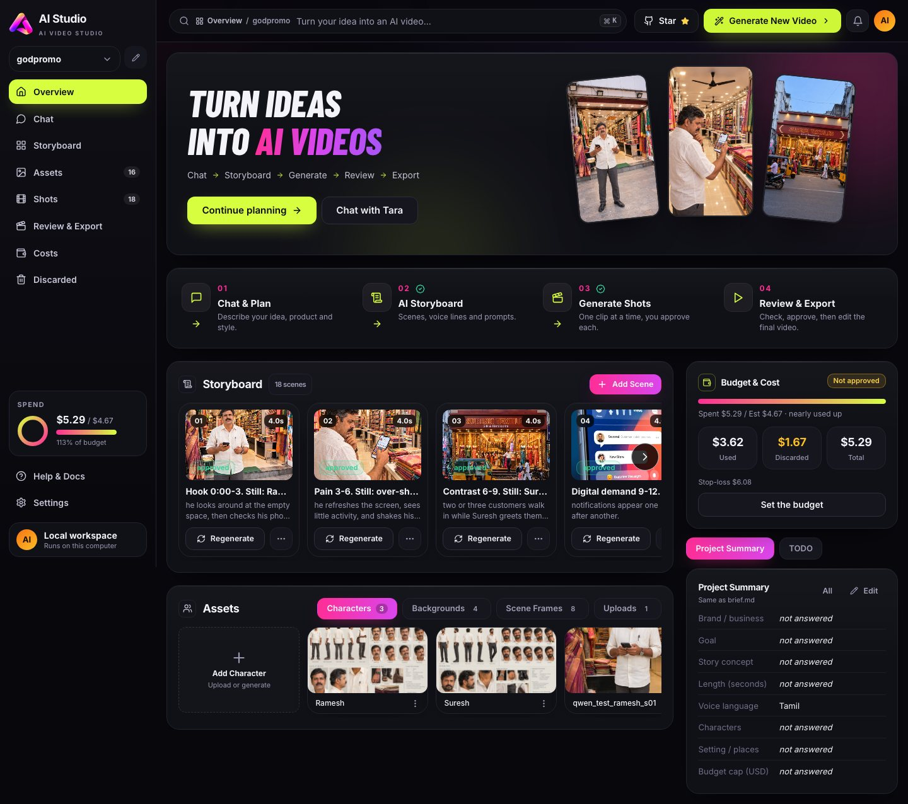

**Chat with Tara and the production checklist**

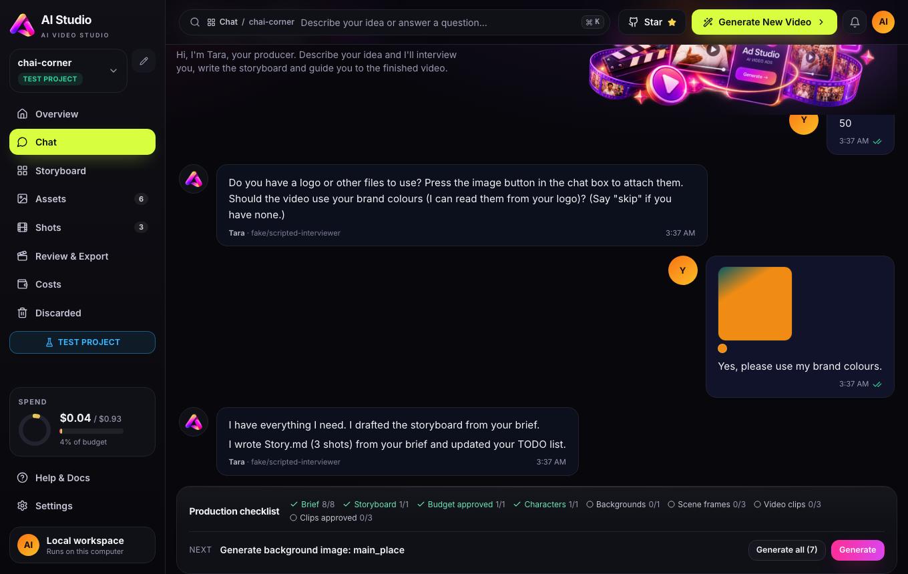

| **Shots**: one clip at a time, with its price | **Assets**: characters, places, frames, uploads |
|---|---|
| 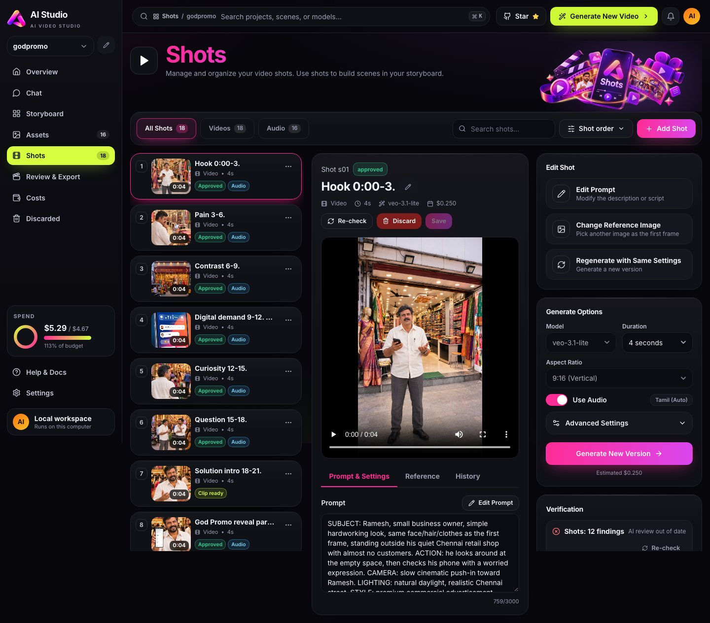 | 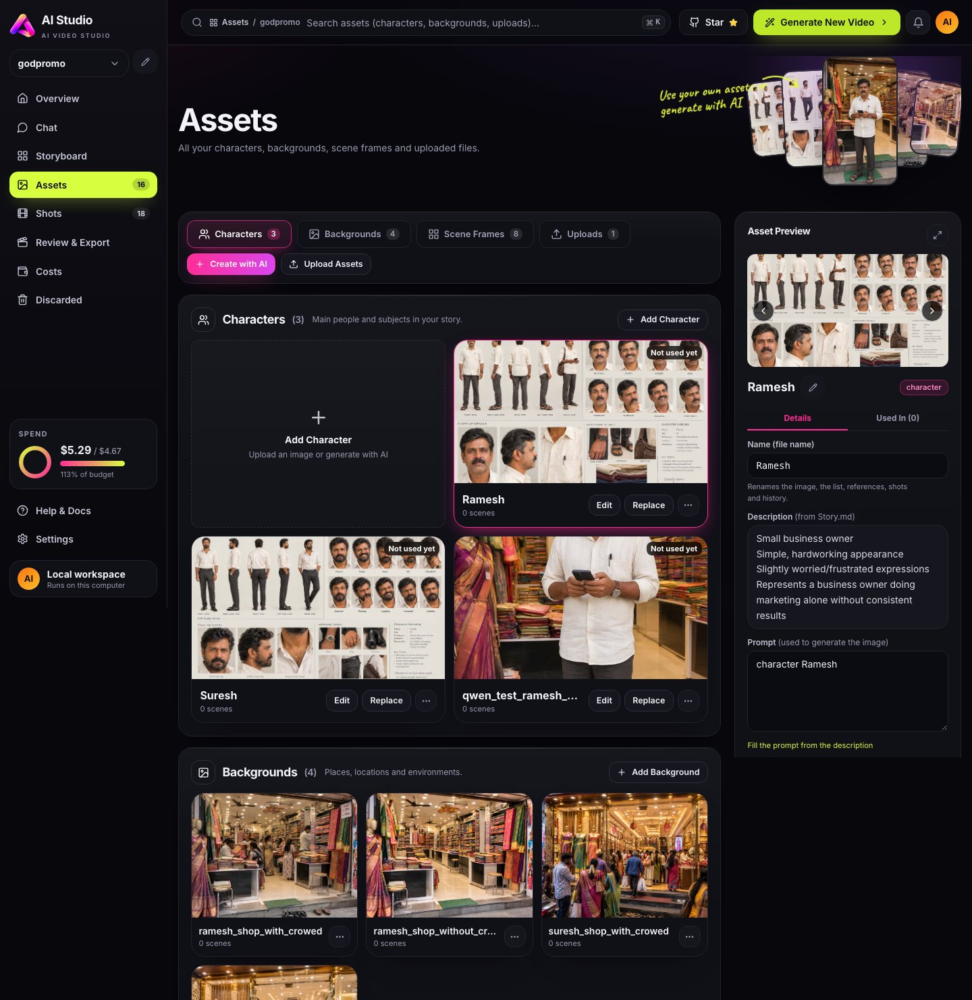 |
| **Review & Export**: timeline, text, music, transitions | **Costs**: used versus discarded, per generation |
| 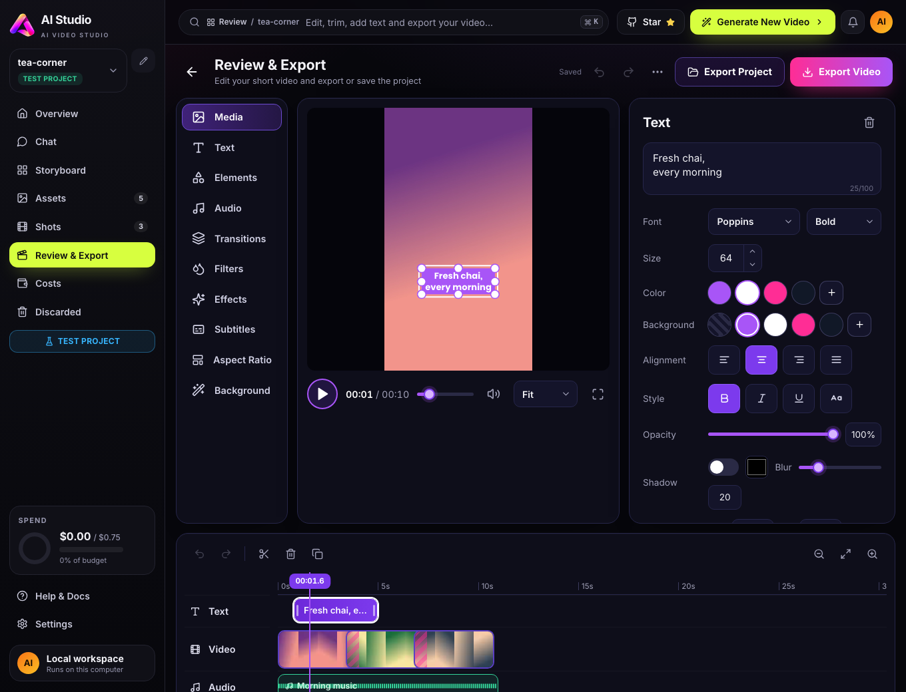 | 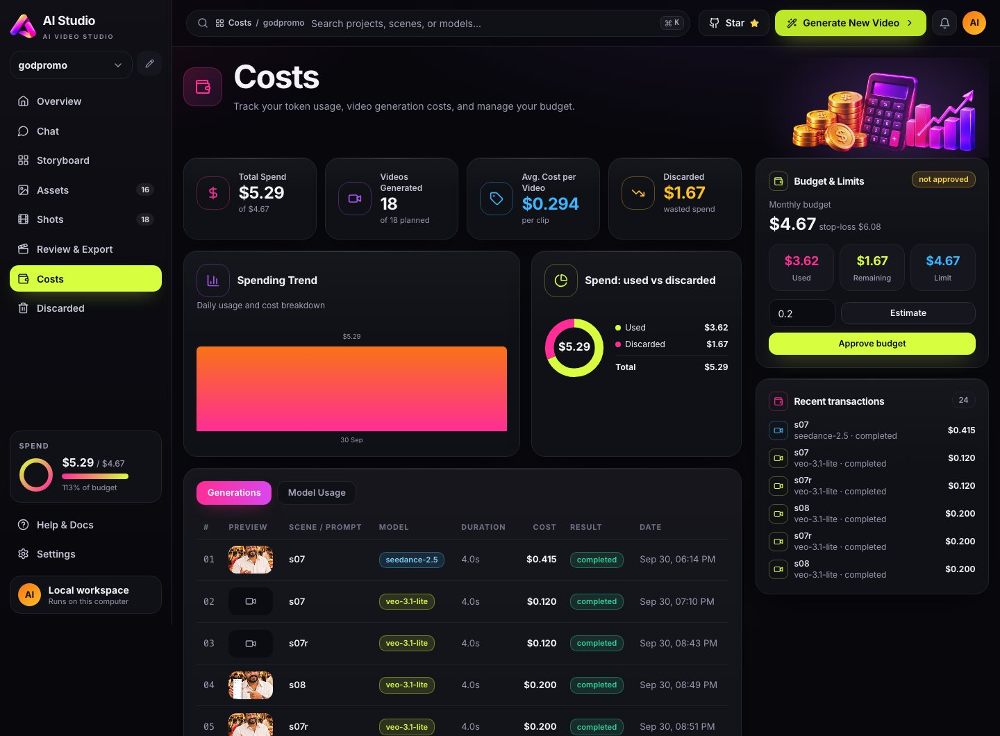 |

**Your projects**: favorites, counts, archive, import

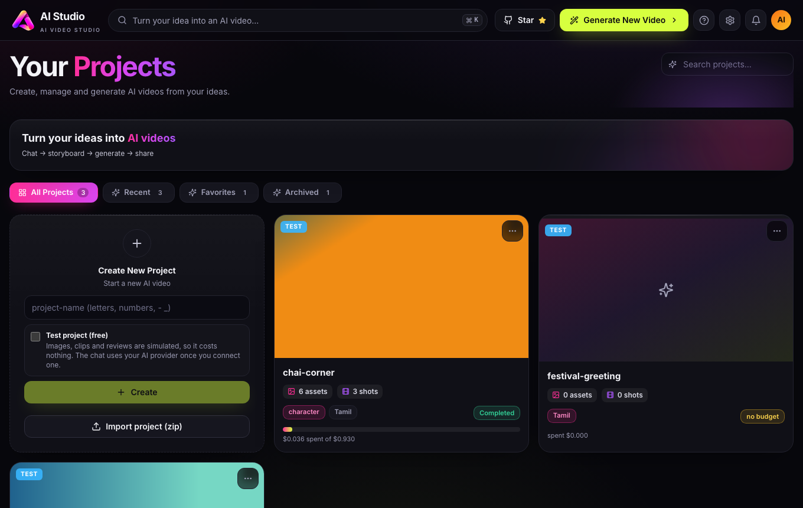

## Quick start

**You need:** Python 3.10+, Node 18+ (once, to build the screens) and `ffmpeg` to export videos (macOS: `brew install ffmpeg`).

```bash
git clone https://github.com/Dinesh-DLanzer/ai-studio && cd ai-studio
./scripts/start.sh            # macOS / Linux   (same as: python3 scripts/start.py)
scripts\start.bat             # Windows         (same as: py scripts\start.py)
```

It prints `http://127.0.0.1:8765/?token=...`. Open that link. The token is your session key, so keep it private.

**First run.** Everything is set up inside the app: no `.env` file, no environment variable for keys, no config file. With no provider connected you are asked how to begin:

- **Set up a provider**: connect one with its API key, choose a chat model (required) and image and video models (recommended), then continue.
- **Try a test project**: everything simulated, free, no key. A banner offers provider setup any time.

Keys are write-only (never shown again) and stored in your OS keychain, or a private file under `~/.aistudio`, never in a project.

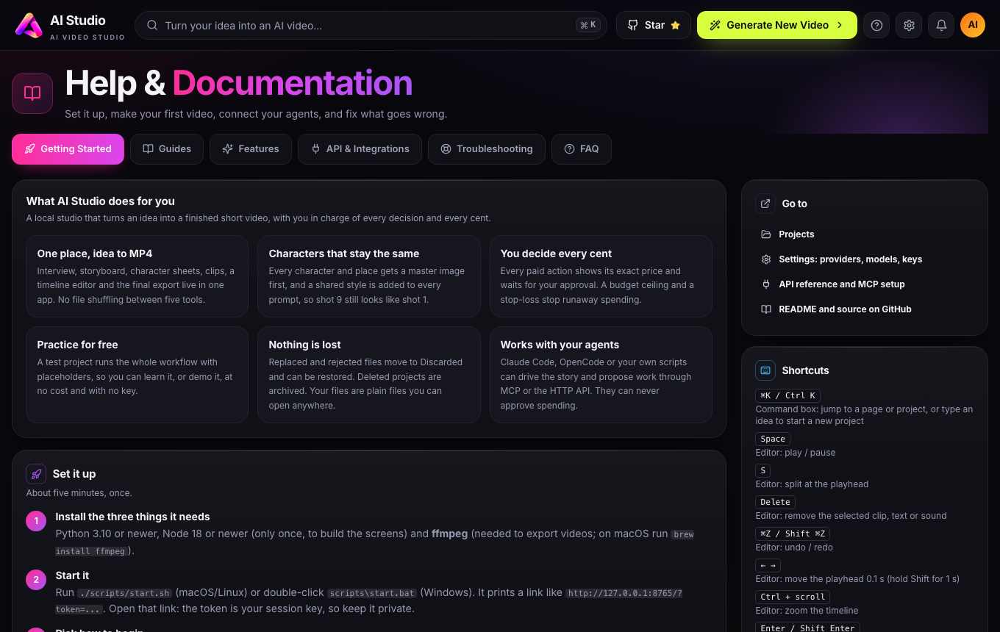

## How a video gets made

1. **Brief.** Answer Tara. Attach a logo with the image button; its colours are read for the shared style.
2. **Storyboard.** Tara writes `Story.md` (shared style, characters, backgrounds, shots); you review and apply it.
3. **Budget.** Check the estimate and approve it once. It is a ceiling; the stop-loss is 130% of it.
4. **Characters and places, then scene frames.** Generate or upload. The server refuses a frame before its characters and a clip before its frame.
5. **Clips.** One per shot, each with its price, up to 3 final attempts per shot.
6. **Approve or discard**, then **Review & Export**.

The checklist under the chat shows exactly where you are. **Generate all** lists everything left with exact prices; you approve once and the items run in order, stopping at the first problem.

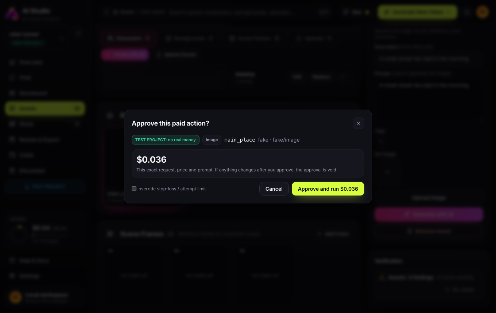

## Safety model

Spending money on AI is the risky part, so the rules live in the engine, not in a prompt.

- Every paid action (image, clip, vision review) is a **proposal** with its exact price. A human approves that proposal in the page or terminal. It runs once; if the prompt, model, price or input image changes, the approval is void.
- A budget must be approved first. A stop-loss (130%) and a 3-attempts-per-shot limit are enforced by the engine.
- **Tara cannot generate, approve or upload anything.** She is told the project's real state every turn, and the page's checklist is the source of truth.
- Agents and API keys can propose but never approve. Provider keys are write-only.
- The server binds to `127.0.0.1`, needs a token, and rejects foreign Host and Origin headers. See [SECURITY.md](SECURITY.md) for the honest limits.

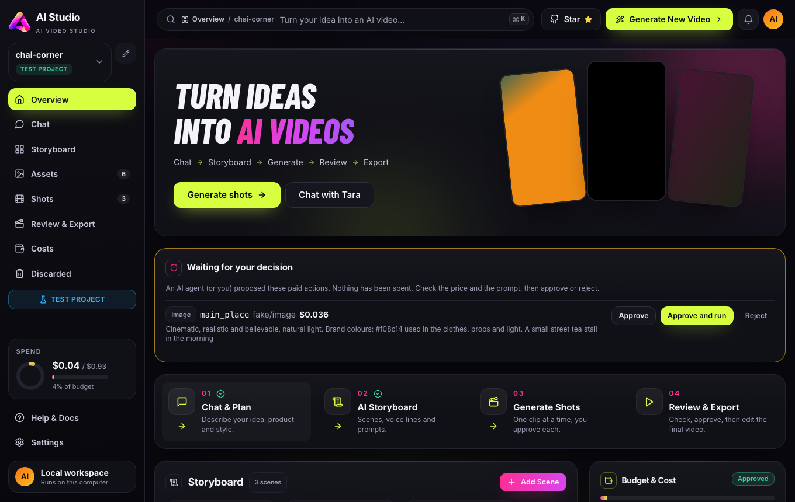

## Agents and the HTTP API

- **MCP** (Claude Code, OpenCode, any client): *Settings > Integrations* and *Help > API & Integrations* show the exact command or config for your install. Tools: create and read projects, write the story and brief, convert, estimate, **propose**, run an already approved proposal, costs, discard and restore.
- **API keys**: *Settings > Integrations* creates revocable keys (shown once, stored only as a hash). A key can do what the MCP tools do and nothing more.
- **Reference**: *Help > API & Integrations* lists every endpoint, read live from the server, and which ones a key may call.
- **Skill** (Claude Code): `.claude/skills/ai-studio/` is the playbook for making a video through the app.

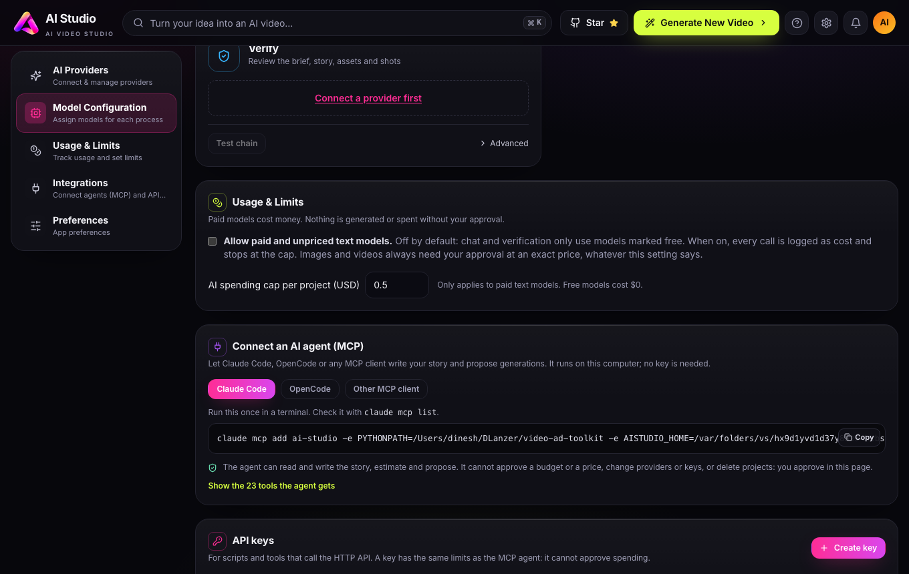

## More details

<details>
<summary><b>Test projects and real projects</b></summary>

There is no app-wide mode. Each project is one or the other, decided by what it contains:

- **Test project**: made with the *Test project* switch, or holding only placeholders. Images, clips and reviews are simulated and cost nothing. Its chat uses your chat model if one is connected, otherwise a built-in scripted interviewer.
- **Real project**: everything else. A project that holds real generated media or real costs is always real. It needs a provider.

`AISTUDIO_ALL_TEST=1` is a switch for automated tests and demos: every project is a test project and the first-run screen is skipped.
</details>

<details>
<summary><b>Providers, models and prices</b></summary>

*Settings > AI Providers* adds providers. *Model Configuration* gives each job (Chat, Verify, Vision, Image, Video) an ordered chain of models: if the first is busy, rate-limited, out of credit or rejected, the next is used, never a dearer one than you approved. Add a model by id if it is not listed, and set a price for any model without one (a paid image or video model with an unknown price cannot run). *Usage & Limits* controls paid text models (off by default) and the per-project AI spending cap.

Prices live in `settings/models.json` and the built-in `rates.json`. Check them against your provider before a big run.
</details>

<details>
<summary><b>Review & Export editor</b></summary>

Your approved clips are already on the timeline. Drag to reorder, drag edges to trim, `S` to split, undo and redo. Add titles, subtitles or caption bubbles (Poppins, Anton, Bebas Neue, Pacifico; colours, bubble, shadow), and music with fades. Pick one of 36 transitions per cut: dissolve, dips to black or white, wipes, slides, cover and reveal, circle, doors, pixelate, zoom, blur, slices and more. Aspect ratio 9:16, 16:9 or 1:1.

**Export Video** renders one MP4 on your computer into `exports/`. Edits save automatically (`edit.json`).
</details>

<details>
<summary><b>Projects: favorites, export, import, archive</b></summary>

- **Favorites**, **Export project (zip)** and **Delete project** are in each card's 3-dot menu; the cards show asset and shot counts.
- **Import project (zip)** accepts a zip made by Export. Every file is checked first, and the whole zip is refused with the reasons if anything is wrong (unsafe paths, links, wrong types, fake media, invalid project files, missing clips, oversized archives). Approvals inside a zip are reset on purpose.
- **Delete** moves a project to the trash folder and never erases it. It appears in the **Archived** tab with a Restore button.
- An unknown address or a missing project shows a proper 404 that can restore it from the trash.
</details>

<details>
<summary><b>Languages, verification, renaming</b></summary>

- **Languages**: English and Tamil are tested with the video model; others are offered with a warning. Voice lines use the language's own script plus an English meaning.
- **Verification** after every change: instant rule checks (colour codes on screen, invented people when a shot has no first frame, Tanglish instead of Tamil script, speech too long for the clip, absolute claims, missing references, unrealistic budget) plus an optional AI review.
- **Rename** a project, an asset or a shot: files, references, first frames, the cost log and the discard history follow.
- **Old projects**: images in `stills/` that the asset list does not know are offered for import.
</details>

## Commands

```bash
python3 -m aistudio.cli serve | projects | pending <p> | approve <p> <id> | approve-budget <p>
python3 -m aistudio.mcp_server           # MCP over stdio
python3 vidad.py -h                      # the original one-file CLI (see GUIDE.md)
node web/e2e/readme-shots.mjs            # retake the screenshots in docs/img
node web/e2e/demo-gif.mjs                # re-record docs/img/demo.gif
```

## Project layout

```
aistudio/      engine: project files, cost log, discard, rates, budget, approvals, gates,
               providers, editor/export, import, API keys, service layer, MCP, CLI
server/        local web API (FastAPI) and its endpoint descriptions (api_docs.py)
web/           React + Tailwind UI (npm run build -> web/dist); web/e2e has the browser tests
assets/fonts/  fonts used by the editor (SIL Open Font License, see THIRD_PARTY_NOTICES.md)
templates/     guided Story / brief / TODO templates
examples/      made-up sample stories
tests/         Python tests (no network, no money)
docs/img/      the screenshots in this README
```

## Tests

```bash
./.venv/bin/python -m unittest discover -s tests
(cd web && npm run build) && for t in shell smoke chat assets import manage agent editor projects settings setup help; do node web/e2e/$t.mjs; done
```

## Status and honest limits

- Proven for **Tamil and English** with Veo 3.1 Lite. For other languages, generate one cheap clip and have a native speaker listen first.
- The vision check is a second pair of eyes, not a judge. It cannot hear the language.
- Providers change prices and filters. Verify prices and model names before a big run.
- Not in the editor yet: stickers, filters, effects, automatic captions.
- Free chat models vary in quality. An unreadable answer is retried once, and you can pick a more reliable model in Settings.
- Single-user and local only. Multi-user or hosted use is not supported.

## Contributing

Issues and pull requests are welcome, and [Discussions](https://github.com/Dinesh-DLanzer/ai-studio/discussions) is open for questions. See [CONTRIBUTING.md](CONTRIBUTING.md) and [SECURITY.md](SECURITY.md), and read the [CHANGELOG](CHANGELOG.md) for what changed.

## License

[MIT](LICENSE). Fonts keep their own SIL Open Font License ([notices](THIRD_PARTY_NOTICES.md)).

You are responsible for how you use generated media: follow each model provider's terms, label AI-generated content where required, and do not imitate real people without consent.
